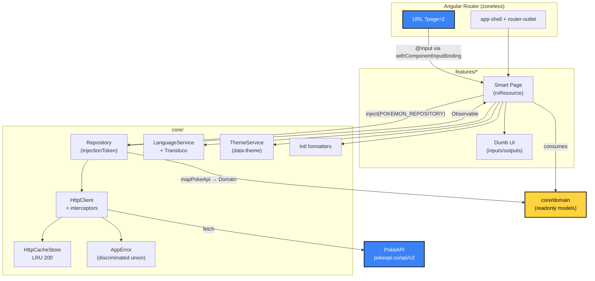

# Pokédex (Angular 21)

SPA neobrutalista que consome a [PokéAPI](https://pokeapi.co/api/v2/)
para listar, buscar e detalhar Pokémons. Suporta troca de idioma
(pt-BR / en) e tema (claro / escuro) em runtime, sem SSR, sem PWA.

## Stack

| Camada        | Escolha                                                                                                |
| ------------- | ------------------------------------------------------------------------------------------------------ |
| Framework     | **Angular 21**, standalone-only, signal-first, zoneless                                                |
| Estilo        | **Tailwind v4** com `@theme` tokens + classes brutalistas em layer                                     |
| Estado        | **Signals + `rxResource`** (sem NgRx) — [ADR-0002](docs/adr/0002-signals-over-ngrx.md)                 |
| HTTP          | `provideHttpClient(withFetch)` + 3 interceptors (baseUrl, cache LRU, error)                            |
| i18n          | **Transloco** com troca em runtime — [ADR-0006](docs/adr/0006-i18n-transloco.md)                       |
| Testes        | **Vitest** via builder nativo `@angular/build:unit-test` — [ADR-0007](docs/adr/0007-vitest-builder.md) |
| Qualidade     | ESLint flat + Prettier+Tailwind + Husky + lint-staged + commitlint                                     |
| Browsers-alvo | Apenas evergreen (últimas 2 versões de Chrome/Edge/Firefox/Safari)                                     |

## Pré-requisitos

- Node.js ≥ 20.19 (ver `.nvmrc` para a versão exata usada no desenvolvimento)
- npm ≥ 10

```bash
node --version  # >= v20.11
npm --version   # >= 10
```

## Scripts

```bash
npm install            # primeira execução
npm run dev            # ng serve em http://localhost:4200
npm run build          # bundle de produção em dist/poke-angular/
npm test               # vitest, modo watch (TTY) ou one-shot
npm test -- --watch=false   # one-shot, ideal para CI
npm run lint           # eslint .
npm run lint:fix       # eslint . --fix
npm run typecheck      # tsc --noEmit em app + spec configs
npm run format         # prettier --write .
npm run format:check   # prettier --check .
```

Husky instala hooks no `npm install`:

- `pre-commit` → lint-staged (prettier + eslint --fix nos arquivos staged)
- `commit-msg` → commitlint (Conventional Commits)

## Estrutura

```
src/app/
├── core/               # singletons, infra cross-feature
│   ├── domain/         # Pokemon, PokemonDetail, EvolutionChain, PokemonType, PokemonStat
│   ├── http/           # AppError, RemoteData, baseUrl/cache/error interceptors, HttpCacheStore
│   ├── i18n/           # Transloco config + LanguageService + testing helper
│   ├── format/         # formatPokedexNumber, formatHeight, formatWeight (Intl.*)
│   ├── theme/          # ThemeService, pokemonTypeBgClass, dark mode tokens
│   ├── navigation/     # NavigationHistoryService (back button intelligence)
│   └── utils/          # cn (class composer)
├── shared/ui/          # design system: BrutalButton/Card/Input/Badge/Skeleton
├── layout/             # AppShell, AppHeader, AppFooter, ThemeToggle, LanguageSwitcher
└── features/
    ├── pokemon-list/   # /
    │   ├── data-access/    # repository + DTOs + mapper
    │   ├── feature/        # smart page (default export, lazy)
    │   ├── ui/             # PokemonCard, ListGrid, ListSkeleton
    │   └── util/           # page-param, brutal-button-classes
    ├── pokemon-detail/ # /pokemon/:name
    │   ├── data-access/    # PokemonDetailRepository + DTOs + mapper
    │   ├── feature/        # smart page
    │   └── ui/             # StatBar, StatsPanel, EvolutionChain (defer), Skeleton
    ├── pokemon-search/ # /search
    │   ├── data-access/    # PokemonIndexRepository (one-shot /pokemon?limit=20000)
    │   ├── feature/        # smart page com debounce + keyboard nav
    │   └── ui/             # HighlightedText (XSS-safe mark)
    └── styleguide/     # /__styleguide (dev-only kitchen sink)

public/
├── i18n/{pt-BR,en}.json
└── img/missing-sprite.svg

docs/
├── adr/                # Architecture Decision Records (00xx)
└── PENDENCIAS.md       # backlog conhecido / itens diferidos
```

Regras inegociáveis: padrão smart/dumb, repositórios isolados via
interface + InjectionToken, DTOs privados ao módulo data-access, UI
nunca importa tipo `*Dto`.

## Arquitetura



**Fluxo padrão de uma feature**:

1. URL muda → Router injeta `@Input` no smart page (via
   `withComponentInputBinding`).
2. Signal de input alimenta um `computed` de `params`.
3. `rxResource({ params, stream })` consome um repository acessado
   por `inject(POKEMON_REPOSITORY)` — interface, não a impl HTTP.
4. Repository → HttpClient → interceptors `[baseUrl, cache, error]`.
5. Resposta atravessa um mapper que projeta DTO → modelo de domínio
   (`readonly`, sem campos PokéAPI vazando).
6. Smart page renderiza com `@switch (true)` sobre
   `isLoading() / error() / isEmpty() / @default`.

## Decisões-chave (ADRs)

| #    | Decisão                                        | Link                                                            |
| ---- | ---------------------------------------------- | --------------------------------------------------------------- |
| 0001 | Manter Architecture Decision Records           | [docs/adr/0001](docs/adr/0001-architecture-decisions-log.md)    |
| 0002 | Signals primários; sem NgRx                    | [docs/adr/0002](docs/adr/0002-signals-over-ngrx.md)             |
| 0003 | HTTP cache in-memory LRU                       | [docs/adr/0003](docs/adr/0003-http-cache-strategy.md)           |
| 0004 | Tailwind: `@theme` + `.brutal-*` no layer      | [docs/adr/0004](docs/adr/0004-tailwind-organisation.md)         |
| 0005 | Design tokens + dark mode 3 camadas            | [docs/adr/0005](docs/adr/0005-design-tokens-and-dark-mode.md)   |
| 0006 | Transloco com troca em runtime + nomes via API | [docs/adr/0006](docs/adr/0006-i18n-transloco.md)                |
| 0007 | Vitest via builder nativo                      | [docs/adr/0007](docs/adr/0007-vitest-builder.md)                |
| 0008 | Paginação clássica em vez de scroll infinito   | [docs/adr/0008](docs/adr/0008-pagination-vs-infinite-scroll.md) |
| 0009 | Busca client-side sobre índice cacheado        | [docs/adr/0009](docs/adr/0009-client-side-search.md)            |

## Trade-offs principais

- **Cache LRU 200 sem TTL**: PokéAPI é imutável na vida da sessão.
  Trade-off: cache zera em refresh, ~10 páginas paginadas começam a
  evict — aceitável.
- **N+1 na listagem**: PokéAPI não tem endpoint enxuto. Repository
  faz `forkJoin` interno; cache mitiga revisitas (20 GETs viram 0 na
  segunda vez).
- **Busca instantânea com índice de 120 kB**: usuário paga 1-2s na
  primeira visita a `/search`. Skeleton cobre o tempo.
- **Apenas evergreen**: nada de polyfill ES6; `:has`, `color-mix`,
  `container queries` usadas livremente.
- **Sem store global**: signals + `rxResource` cobrem todos os
  fluxos. Se o app ganhar mutações, `@ngrx/signals` é o caminho de
  migração com menor atrito.
- **`@defer` + Vitest**: contornado extraindo o bloco `@defer` para
  um wrapper (`PokemonEvolutionSection`) — todos os specs do detail
  smart passam. Histórico em `docs/PENDENCIAS.md`.

## Testes

```bash
npm test -- --watch=false   # 40 spec files / 177 specs passing
npm test -- --coverage      # gera relatório em coverage/
```

Inclui um spec de integração via `RouterTestingHarness` cobrindo o
fluxo listing → detail, e um spec de regressão protegendo o
bootstrap eager de `NavigationHistoryService` (o que faz o botão
Voltar do detail acertar de primeira).

Padrão por camada:

- **Mapper / util** — função pura, spec em testbed-less Vitest puro.
- **Repository** — `provideHttpClient(withInterceptors(...))` +
  `provideHttpClientTesting()`; assert sequência de requests e
  shape do domain emitido.
- **Service** (Theme, Language, NavigationHistory) — `TestBed.inject`
  - stubs de `matchMedia`/`navigator.language`/`localStorage`.
- **Dumb component** — host harness component em
  `@Component({ template: '<app-thing />' })`, asserts contra DOM
  rendered e atributos ARIA, **nunca contra implementação interna**.
- **Smart component** — stub do `*_REPOSITORY` via
  `{ provide: TOKEN, useValue: stub }`, drive transições por
  `Subject.next` / `.error`, asserts contra DOM.

## i18n

JSONs em `public/i18n/{pt-BR,en}.json`. A `LanguageService` lê
`localStorage` > `navigator.language` exato > prefixo > default
`pt-BR`. Toggle no header altera o signal; um `effect` aplica em
`TranslocoService.setActiveLang` e em `<html lang>`.

Para Pokémons, **nomes localizados vêm da PokéAPI** (
`/pokemon-species/{id}.names[]`), não traduzidos manualmente.
Labels de tipo e stat, que a PokéAPI não traduz consistentemente,
estão sob nosso controle em `detail.stat.*` e bandejas dedicadas.

## Identidade visual

Neobrutalismo: bordas 3 px ink, hard shadows offset puro, cores
saturadas, tipografia Space Grotesk (display + sans) + JetBrains
Mono (números/stats). Comportamento de hover (`translate +
shadow-shrink`) e press (`translate + shadow-none`) são
encapsulados em `.brutal-interactive` no `@layer components` — ver
[ADR-0004](docs/adr/0004-tailwind-organisation.md).

Os 18 tipos de Pokémon têm cores em `tokens.css` e são safelisted
em `styles.css` (utilities `bg-type-*` / `text-type-*` são
construídas em runtime via template literal — Tailwind não as
detecta no scan estático).

## Limitações conhecidas

`docs/PENDENCIAS.md` lista o backlog histórico — todos os itens
estão fechados. Pendências residuais conhecidas (não bloqueadoras):

- 4 warnings PostCSS `& -> Empty sub-selector` durante `ng build`
  são baseline interna do Tailwind v4 (não vêm do nosso CSS, não
  afetam o output final). Reavaliar quando atualizar o Tailwind.

## Como foi construído

Implementação conversacional com [Claude Code](https://claude.com/claude-code).
Cada fase entrou como commits atômicos Conventional Commits — vide
`git log --oneline` — e o agente foi orientado a verificar mudanças
em browser real via Playwright MCP antes de reportar conclusão. A
CLI ficou responsável por: tokens de design, route table,
interceptors, camada de repositórios, separação smart/dumb, ADRs e
suite de testes. As decisões foram ratificadas pelo humano fora do
loop.

## Licença

MIT — ver [`LICENSE`](./LICENSE). Dados de Pokémon agradecidos à
[PokéAPI](https://pokeapi.co/) (livre para uso não-comercial).
